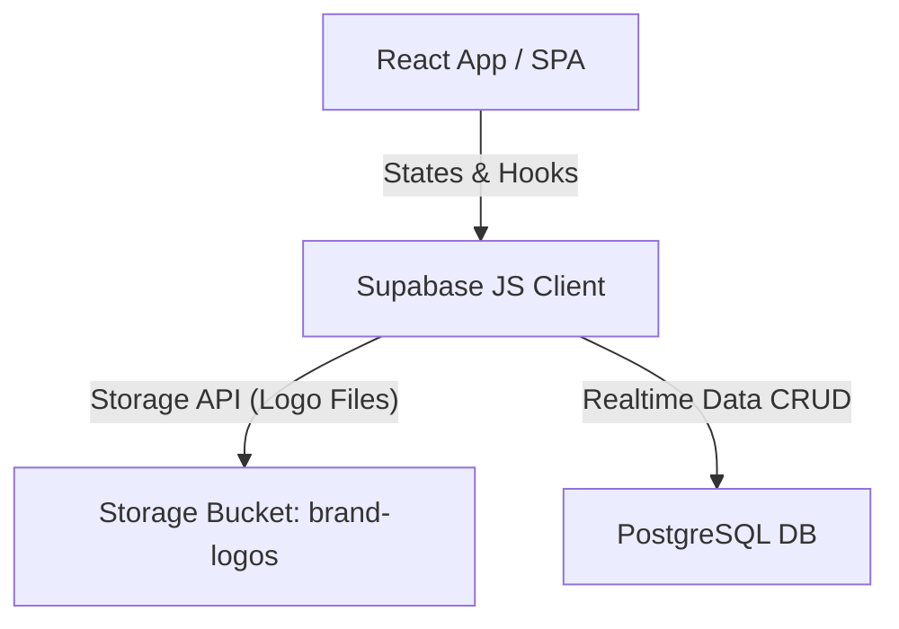

# GENOMA Application Architecture

Welcome to the **GENOMA** developer documentation. This document provides a high-level overview of the application's directory structure, architectural layers, styling design system, and key client-side implementation patterns.

---

## Directory Structure

GENOMA is structured as a modern single-page web application (SPA) backed by a PostgreSQL database via a real-time serverless platform (Supabase).

```text
GenomaHub/
├── docs/                      # Developer reference & detailed specifications
│   ├── ARCHITECTURE.md        # [This File] General architecture, layers & theme details
│   ├── DATABASE_SCHEMA.md     # Full DB dictionary, schemas, relationships & RLS
│   └── MODULES_AND_FLOWS.md   # Core page modules, state, and business logic flows
├── public/                    # Static assets
│   ├── logos/                 # Dynamic local fallbacks (if any)
│   ├── favicon.ico
│   └── GENOMA_Icon.png
├── src/                       # Application source
│   ├── components/            # Reusable React components
│   │   ├── Sidebar.jsx        # Collapsible side navigation with active indicator and branding
│   │   ├── Modal.jsx          # Reusable glassmorphic, animated overlay card
│   │   ├── Toast.jsx          # Toast notification viewport
│   │   ├── QuoteDetailsModal.jsx # Read-only Quotation review layout
│   │   └── InvoiceDetailsModal.jsx # Detailed invoice viewer with lines listing
│   ├── lib/                   # Utility helpers and core libraries
│   │   ├── supabase.js        # Supabase API client connection setup
│   │   ├── generateQuotePDF.js # Advanced vector letterhead PDF layout compilation
│   │   └── letterheadBase64.js # Base64 vector asset memory file for secure pdf-lib stitching
│   ├── pages/                 # Primary page views (Dashboard, Catalog, Inventory, etc.)
│   ├── App.jsx                # Collapsible sidebar layout, routing core, global toast context
│   ├── index.css              # Custom property design system, utility rules, and scrollbars
│   └── main.jsx               # React DOM render entrypoint
├── .env                       # Local environment secrets (VITE_SUPABASE_URL, VITE_SUPABASE_ANON_KEY)
├── supabase_schema.sql        # Database tables definition reference file
├── supabase_seed.sql          # DB seed data reference file
├── package.json               # Package dependencies & launch scripts
└── vite.config.js             # Vite building configuration
```

---

## Architectural Layers

The application follows a clean 3-tier decoupling that avoids bloating or redundant server overhead:



### 1. Presentation Layer (Vite + React)
- **Component-Driven Views**: Built using React hooks (`useState`, `useEffect`, `useRef`) for local modular state containment.
- **Routing Module**: `react-router-dom` handles client-side route tracking. The main frame resides in `App.jsx` and draws a permanent sidebar and layout box.
- **Micro-Animations**: Keyframes like `fadeIn`, `slideUp`, and `slideInRight` are defined in `index.css` to add high-fidelity loading sequences across components.

### 2. Services Layer (Supabase Web SDK)
- All requests communicate directly from the client to the serverless DB endpoint using the `@supabase/supabase-js` package.
- **Realtime Integration**: Supabase client triggers direct actions, avoiding the need for an intermediate Node.js server.
- **Blob File Storage**: The `brand-logos` bucket securely stores manufacturer logos via simple binary upload.

### 3. Data Store Layer (Supabase PostgreSQL)
- **Relational Integrity**: Foreign key constraints ensure strict cascades and validation (e.g., invoice lines must link to active batch records).
- **Security Checkpoints**: Row Level Security (RLS) policies guard public access and limit creation bounds to valid payloads.

---

## Visual Aesthetics & CSS Core

GENOMA is powered by a curated, elegant, and highly interactive custom design system using Vanilla CSS custom properties. It leverages HSL-aligned tones and rich dark gradients mapped on top of crisp light panels.

### Key Custom Properties (`src/index.css`)
- **Primary Brand Color**: `#b91c1c` (Crimson Red extracted from the GENOMA logo), utilized for key action triggers, total amounts, navigation focus indicators, and headers.
- **Accent Tones**: `#1f2937` (Charcoal Black), framing borders and dark buttons.
- **Backdrop Filtering**: `backdrop-filter: blur(24px)` combined with semi-opaque backgrounds (`rgba(255, 255, 255, 0.85)`) generates high-end glassmorphic effects for modals and cards.
- **Interaction Enhancements**: State changes (like `:hover` on cards or tables) trigger quick-rising transitions (`250ms cubic-bezier(0.4, 0, 0.2, 1)`) along with a subtle crimson red drop-shadow glow (`0 0 20px rgba(185, 28, 28, 0.08)`).

---

## Advanced Hybrid PDF Compiler

Generating laboratory quotations requires absolute pixel-perfection. To achieve this, the PDF generator implements a unique hybrid rendering workflow:

1. **Content Draft (`jsPDF` + `jspdf-autotable`)**:
   - Compiles the dynamic quote details, dates, items table (with custom paddings, currency symbols, and headers), and text blocks on a virtual canvas.
   - Generates an intermediate binary buffer in memory.

2. **Letterhead Overlay (`pdf-lib`)**:
   - The primary vector letterhead is stored inside a highly compacted memory module (`src/lib/letterheadBase64.js`) to guarantee absolute independence from network speed and eliminate double-download interception issues caused by browser extensions (e.g., IDM).
   - `pdf-lib` loads this base template, imports the generated jsPDF content as a transparent overlays canvas, and stamps it securely on top of the vector backgrounds.

3. **Multi-page Support**:
   - For extensive lists that cross standard bounds, the script dynamically spawns extra letterhead sheets and overlays additional items tables seamlessly.
