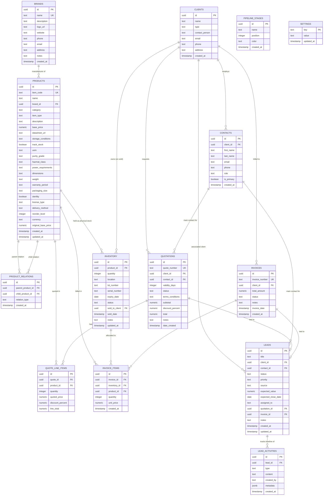

# GENOMA Database Schema

This document details the Supabase PostgreSQL database schema powering the **GENOMA** platform. It provides an entity relationship diagram (ERD), full data dictionary for all 12 tables, relationships, and the active security configuration (RLS).

---

## Entity Relationship Diagram (ERD)

---

## Data Dictionary

### 1. `public.brands`
Contains catalog manufacturers and software developers.
- **`id`** (`uuid`, Primary Key): Default generated UUID.
- **`name`** (`text`, Unique, Required): Official name of the brand.
- **`description`** (`text`): Optional summary.
- **`logo_url`** (`text`): URL to the uploaded PNG/JPG.
- **`website` / `phone` / `email` / `address`** (`text`): Manufacturer metadata.
- **`notes`** (`text`): Special comments/notes.
- **`created_at`** (`timestamp with time zone`): Default `now()`.

### 2. `public.products`
The core catalog item index with dynamic attributes.
- **`id`** (`uuid`, Primary Key): Default generated UUID.
- **`item_code`** (`text`, Unique, Required): Primary identifier (e.g. `SEQ-NOVA-6000`).
- **`name`** (`text`, Required): Product label.
- **`brand_id`** (`uuid`, Foreign Key -> `brands.id`): Manufacturer link.
- **`category`** (`text`, Default `'Consumables'`): Group catalog grouping.
- **`item_type`** (`text`, Default `'Kit'`): Checked against specific allowed values: `Instrument`, `Spare Parts`, `Kit`, `Chemical`, `Control`, `Labware`, `General`, `License`, `Maintenance`, `Training`.
- **`description`** (`text`): Details of the product.
- **`base_price`** (`numeric`, Required, Default `0`): List price in EGP.
- **`datasheet_url`** (`text`): Hyperlink to PDF.
- **`storage_conditions`** (`text`): Conditions (e.g., `-20°C`).
- **`track_stock`** (`boolean`, Default `true`): If false, ignores inventory tracking calculations.
- **`reorder_level`** (`integer`, Default `5`): Threshold under which alert triggers.
- **`currency`** (`text`, Default `'EGP'`): Original catalog currency for FX pricing Shield (`EGP`, `USD`, `EUR`).
- **`original_base_price`** (`numeric`): Unmodified cost baseline in its original specified currency.
- Category-specific attributes:
  - *Chemicals/Reagents*: `uom` (Unit of Measure), `purity_grade`, `hazmat_class`.
  - *Instruments*: `power_requirements`, `dimensions`, `weight`, `warranty_period`.
  - *Labware/Consumables*: `packaging_size`, `sterility`.
  - *Software*: `license_type`, `delivery_method`.

### 3. `public.product_relations`
Maps sibling assets (accessories, spare parts, consumable packages).
- **`id`** (`uuid`, Primary Key): Generated UUID.
- **`parent_product_id`** (`uuid`, Foreign Key -> `products.id`): Parent item.
- **`child_product_id`** (`uuid`, Foreign Key -> `products.id`): Linked item.
- **`relation_type`** (`text`, Default `'Accessory'`): Description.

### 4. `public.inventory`
Ledger of physical shipments and lots.
- **`id`** (`uuid`, Primary Key): Generated UUID.
- **`product_id`** (`uuid`, Foreign Key -> `products.id`): Associated product.
- **`quantity`** (`integer`, Default `0`): Batch count remaining. Locks to `1` for instruments.
- **`location`** (`text`): Storage coordinates (e.g. `Freezer A, Shelf 2`).
- **`lot_number`** (`text`): Lot identification.
- **`serial_number`** (`text`): Serial number (for Instruments).
- **`expiry_date`** (`date`): Reagent shelf expiration.
- **`status`** (`text`, Default `'Available'`): `Available`, `In Use`, `Quarantined`, `Expired`, `Sold`.
- **`sold_to_client`** (`uuid`, Foreign Key -> `clients.id`): Populated upon final invoice.
- **`sold_date`** (`timestamp with time zone`): Date marked as sold.
- **`notes`** (`text`): Adjustments context.

### 5. `public.clients`
Primary organizations list.
- **`id`** (`uuid`, Primary Key): Generated UUID.
- **`name`** (`text`, Required): Company/hospital/lab legal name.
- **`type`** (`text`, Default `'Laboratory'`): Checked category.
- **`contact_person` / `email` / `phone` / `address`** (`text`): Organization contacts.

### 6. `public.contacts`
Sub-accounts for direct personnel under client organizations.
- **`id`** (`uuid`, Primary Key): Generated UUID.
- **`client_id`** (`uuid`, Foreign Key -> `clients.id`): Parent organization.
- **`first_name` / `last_name`** (`text`, Required): Contact name.
- **`email` / `phone` / `role`** (`text`): Standard contact data.
- **`is_primary`** (`boolean`, Default `false`): Flag for default selections.

### 7. `public.quotations`
Sales quotations records.
- **`id`** (`uuid`, Primary Key): Generated UUID.
- **`quote_number`** (`text`, Unique, Required): Formatted custom sequence (e.g., `Q-2026-001`).
- **`client_id`** (`uuid`, Foreign Key -> `clients.id`): Recipient organization.
- **`contact_id`** (`uuid`, Foreign Key -> `contacts.id`): Primary billing recipient.
- **`validity_days`** (`integer`, Default `30`): Offer timeline.
- **`status`** (`text`, Default `'Draft'`): Verified statuses: `Draft`, `Sent`, `Accepted`, `Rejected`.
- **`terms_conditions`** (`text`): Custom contractual terms.
- **`subtotal` / `discount_percent` / `total`** (`numeric`): Calculated finance parameters.

### 8. `public.quote_line_items`
Detailed listings on proposals.
- **`id`** (`uuid`, Primary Key): Generated UUID.
- **`quote_id`** (`uuid`, Foreign Key -> `quotations.id`): Parent proposal.
- **`product_id`** (`uuid`, Foreign Key -> `products.id`): Catalogs line asset.
- **`quantity`** (`integer`, Default `1`): Number requested.
- **`quoted_price`** (`numeric`, Required): Unit price offered.
- **`discount_percent`** (`numeric`): Optional item line discount.
- **`line_total`** (`numeric`): Calculated line balance.

### 9. `public.invoices`
Final billing documents.
- **`id`** (`uuid`, Primary Key): Generated UUID.
- **`invoice_number`** (`text`, Unique, Required): Serial identifier.
- **`client_id`** (`uuid`, Foreign Key -> `clients.id`): Parent organization.
- **`total_amount`** (`numeric`, Default `0`): Net financial balance in EGP.
- **`status`** (`text`, Default `'Draft'`): `Draft`, `Finalized`.
- **`notes`** (`text`): PO reference or instructions.

### 10. `public.invoice_items`
Billed ledger lines linking directly to specific physical inventory batches.
- **`id`** (`uuid`, Primary Key): Generated UUID.
- **`invoice_id`** (`uuid`, Foreign Key -> `invoices.id`): Parent invoice.
- **`inventory_id`** (`uuid`, Foreign Key -> `inventory.id`): Allocated stock batch.
- **`product_id`** (`uuid`, Foreign Key -> `products.id`): Catalogs item.
- **`quantity`** (`integer`, Default `1`): Deducted amount.
- **`unit_price`** (`numeric`): Selling price.

### 11. `public.leads`
Kanban deals tracking.
- **`id`** (`uuid`, Primary Key): Generated UUID.
- **`title`** (`text`, Required): Deal descriptor.
- **`client_id`** (`uuid`, Foreign Key -> `clients.id`): Recipient company.
- **`contact_id`** (`uuid`, Foreign Key -> `contacts.id`): Associated person.
- **`status`** (`text`, Default `'New'`): Stages track status (referencing `pipeline_stages`).
- **`priority`** (`text`, Default `'Medium'`): `Low`, `Medium`, `High`.
- **`expected_value`** (`numeric`): Deal valuation in EGP.
- **`quotation_id`** (`uuid`, Foreign Key -> `quotations.id`): Generated quotation.
- **`invoice_id`** (`uuid`, Foreign Key -> `invoices.id`): Finalized invoice.

### 12. `public.pipeline_stages`
Dynamic customizable stages for sales.
- **`id`** (`uuid`, Primary Key): Generated UUID.
- **`name`** (`text`, Required): Label (e.g. `'Negotiation'`).
- **`position`** (`integer`, Default `0`): Sorting weight for Kanban lanes.
- **`color`** (`text`, Default `'#6b7280'`): Display HEX code color.

### 13. `public.settings`
Global system configuration parameters.
- **`key`** (`text`, Primary Key, Required): Setting identifier (e.g. `USD_to_EGP`, `EUR_to_EGP`).
- **`value`** (`text`, Required): Setting value (e.g. currency multiplier value).
- **`updated_at`** (`timestamp with time zone`): Default `now()`.

---

## Row Level Security (RLS) & Policies

To ensure instant global configuration without authentication friction, GENOMA relies on open access tables combined with write guards:

- **`brands` Table Policies**:
  - `Allow public read`: Enabled for all users (`SELECT`).
  - `Allow public insert/update`: Enabled to allow adding and editing manufacturer profiles directly from the settings drawer.

- **`brand-logos` Storage Bucket Policies**:
  - `Allow public reads`: Mapped to bucket `public` directory.
  - `Allow public uploads`: Mapped to allow any object addition to bucket folder paths, resolving RLS upload failures.

- **`settings` Table Policies**:
  - `RLS Disabled`: Row Level Security is explicitly disabled (`ALTER TABLE public.settings DISABLE ROW LEVEL SECURITY;`) to enable instant global configuration and multiplier writes without authentication friction under anon Supabase client..
