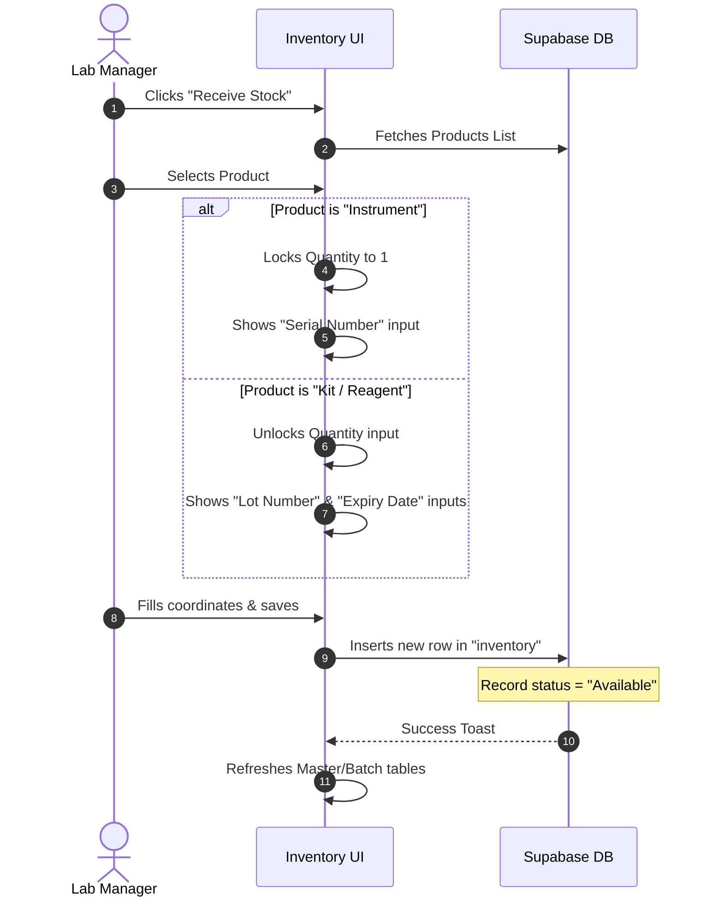
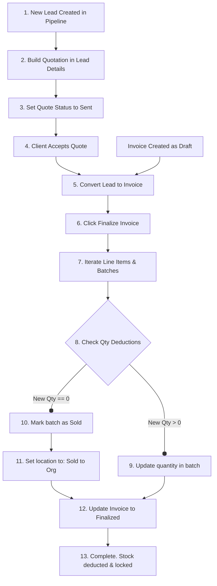
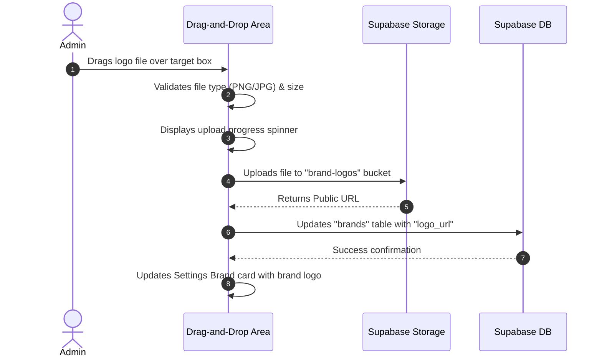

# GENOMA Modules & User Flows

This document details the frontend implementation of each page, the state structures, and the user flows that drive key lab operations in **GENOMA**.

---

## 🖥️ Page Modules Overview

### 1. Dashboard (`Dashboard.jsx`)
- **Key Purpose**: High-level telemetry of laboratory finances, catalog limits, critical warnings, and lead trends.
- **State Details**:
  - `kpis`: Aggregates overall database valuations (Total Invoices value, Total accepted quotes value, Active Leads volume, and Critical Warnings count).
  - `salesTrend` & `leadDistribution`: Maps timeline data to simple components using `recharts` (`AreaChart`, `PieChart`, `Tooltip`).
  - `alerts`: Displays a subset of expiry warnings and out-of-stock items, serving as an entry point for quick remedies.
- **Data Load**: Queries aggregations using `supabase.from()` on load.

### 2. Product Catalog (`Catalog.jsx` & `ProductDetails.jsx`)
- **Key Purpose**: Inventory taxonomic definitions and catalog management.
- **Dynamic Catalog Add/Edit**:
  - Selecting an `item_type` triggers the modal form to swap inputs dynamically using a clean Javascript mapping of attribute columns (e.g. `uom` appears for reagents, `power_requirements` for instruments).
- **Product Details page (`/catalog/:id`)**:
  - **Tabs System**: Splits details between **Overview** (specifications, dimensions), **Stock Ledger** (active shipments, lot ledgers, serial numbers), and **Linked Accessories** (mapping parent-to-child components like Rotors to Centrifuges).

### 3. Smart Inventory Master/Batch View (`Inventory.jsx`)
- **Key Purpose**: Multi-shipment batch tracking.
- **The Grouping Architecture**:
  - Fetches the raw `inventory` tables and groups them in memory by `product_id`.
  - Accumulates `quantity` fields to render a top-level summary row (**Master View**).
  - Integrates an interactive disclosure arrow that opens individual records showing separate `lot_number`, `serial_number`, and `expiry_date` (**Batch View**).
- **Smart Receiving**:
  - Selecting a product changes the prompt dynamically. For Kits, it requires a lot number and expiration date. For Instruments, it locks quantity to `1` and prompts for a serial number.

### 4. CRM & Organizations (`Organizations.jsx` & `OrganizationDetails.jsx`)
- **Key Purpose**: Client profiles management.
- **Structure**: Treating clients as Organizations that house individual Contacts.
- **Organization Details**:
  - Left panel: General coordinates (address, sector, classification).
  - Right tabs: Tracks **Quote History**, **Invoice Ledger**, and **Timeline Logs** related to the specific organization.

### 5. Sales Pipeline Kanban Board (`SalesPipeline.jsx`)
- **Key Purpose**: Sales pipeline management.
- **DnD Architecture**:
  - Dynamic visual board grouped into stages (stages loaded from `pipeline_stages`).
  - Dragging a card triggers a database update (`supabase.from('leads').update({ status: targetStage })`), reflecting the changes in real-time.
- **Lead Slide-over**:
  - Double-clicking a card opens a modal housing the **Activity Timeline**. It allows adding custom logs (notes, email logs, calls) and supports quick actions to **Create Quotation** or **Generate Invoice** directly from the lead.

### 6. Quotation Builder (`Quotations.jsx`)
- **Key Purpose**: Vector proposal compiler and validity tracker.
- **State Builders**:
  - Tracks a client selection, automatically retrieving primary contacts.
  - Interactive product searching dropdown allows adding custom line items, calculating dynamic subtotals and discounts in EGP.
- **PDF Core**: Integrated with `generateQuotePDF()` to stitch dynamic text blocks on top of the vector letterhead base.

### 7. Invoices & Inventory Deduction (`Invoices.jsx` & `InvoiceDetailsModal.jsx`)
- **Key Purpose**: Financial ledger mapping and stock adjustments on finalization.
- **Draft Actions (Edit / Delete)**:
  - Draft invoices can be **Edited** or **Deleted** before finalization.
  - **Edit Mode**: Safely restores draft line items, matches contact selections, and calculates maximum available item quantity limits (i.e. existing batch quantity + current draft allocated quantity) to ensure items are not over-committed.
  - **Delete Mode**: Clears allocated `invoice_items` and deletes the parent invoice cleanly upon confirmation.
- **Deduction & Finalization Flow**:
  - Creating an invoice saves it as a `Draft` (which reserves no stock).
  - Finalization triggers an atomic transactional stored procedure (`public.finalize_invoice` RPC) that deducts quantities directly from the referenced physical batches in `inventory`. If a batch quantity drops to `0`, its status changes to `Sold`, its location updates to `'Sold to: [Org Name]'`, and its owner links directly to the client's organization.

### 8. System Configurations Settings (`Settings.jsx`)
- **Key Purpose**: Configuration hub for brands, pipeline stages, and currency exchange rates.
- **Exchange Rates Manager**:
  - Displays dynamic configuration multipliers (e.g. `USD_to_EGP`, `EUR_to_EGP`) directly linked to the public `settings` table.
  - Changes are written live to Supabase settings using the anon key, bypassing RLS security friction to enable seamless global FX rate adjustments across Genoma's price calculations.
- **Brand Manager**:
  - Grid of card listings representing active manufactures.
  - **Drag-and-Drop Logo Upload**: Dragging files triggers a direct stream upload to the Supabase Storage bucket `brand-logos`, saving the public URL directly in the brand's record.
- **Pipeline Stage Editor**:
  - Lists, orders, color-codes, and manages pipeline stages, reflecting updates across the Sales Pipeline kanban lanes instantly.

---

## 🔄 Core Business Flows

### 1. The Stock Receiving Flow
This sequence shows how incoming stock is registered in the database, validating items against taxonomic rules:

### 2. The Quotation-to-Invoice Lifecycle
This flowchart details how a sale progresses from a CRM lead to a finalized invoice and stock deduction:

### 3. The Secured Brand Logo Drag-and-Drop Flow
Describes the drag-and-drop file upload workflow inside Settings:

